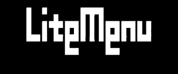
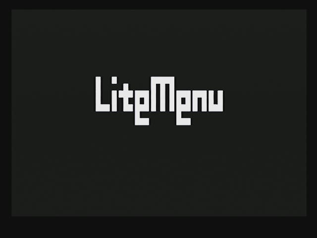
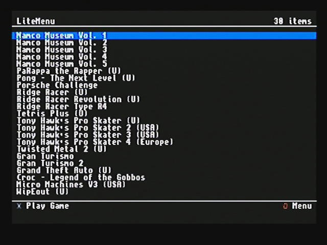
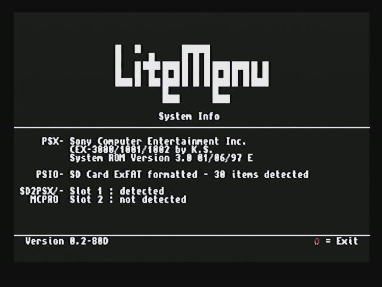
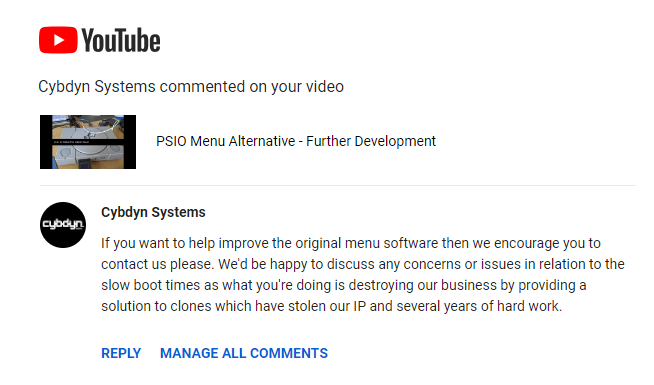

# Alternative Menu Software for PSIO and Compatibles

Replacement menu software for PSIO devices. Open source, uses no libraries and can be built easily using modern tools, on modern operating systems.

YouTuber I am not, but see here for some videos of it in action..

* [ [Cold boot - menu]](https://youtu.be/DdBWPib5Gmg)
* [ [Demonstration of GameID Support]](https://youtube.com/shorts/OfLvMkrLHMU)
* [ [Early video of progress]](https://youtu.be/D4ScWW8lv1w)

## Introduction

Litemenu is a lightweight replacement for the standard menu software shipped with these devices. Latest update has been teased for years now, with the devices creator making promise after promise with nothing delivered. This took a turn for the worst recently, with the creator deleting the forums and restricting access to the official discord server. Feels like someone wants to rewrite history lol. Absolute shame for the customers of PSIO and totally unfair. 

Anyway yeah - original software is slow to boot, has no development features at all, doesnt broadcast gameid and did I already say its slow?

No idea on the actual size of the official software - its a highly polished affair with music, graphics and some 3D spinning models. Unfortunately it has been reported to be using Sony code (PsyQ libraries etc).
Litemenu on the otherhand uses no official Sony libs, hell it barely uses a development kit. It can be built easily using modern tools.

## Installing

Delete the existing MENU.SYS file from your SDcard, grab the latest release and copy MENU.SYS to the root of your SD card. 
Instructions for building from source will be added shortly.

## Litetool

Litetool is the client for the serial server in litemenu. It lets you upload BIN/EXE files to your PSX as well as dumping memory. Like hitserial but a lot faster with a few more features. It runs at 1036800bps so its pretty nippy. See lite_tool folder for the client.

## Warning

* DO NOT ATTEMPT TO MOUNT/USE THE ORIGINAL MENU.SYS USING LITEMENU - IT WILL NOT WORK AND IT WILL MAKE THE CART UPDATE ITSELF FROM SPI FLASH
* DO NOT ATTEMPT TO MOUNT/USE THE ORIGINAL MENU.SYS USING LITEMENU - IT WILL NOT WORK AND IT WILL MAKE THE CART UPDATE ITSELF FROM SPI FLASH
* DO NOT ATTEMPT TO MOUNT/USE THE ORIGINAL MENU.SYS USING LITEMENU - IT WILL NOT WORK AND IT WILL MAKE THE CART UPDATE ITSELF FROM SPI FLASH

## Screenshots

## Feature Comparison

Feature|Standard Menu | Lite Menu |
------------|-----|----|
noca$h unlock (boot CD-R)| nope | yup
psx-exe/bin upload&download| nope | yup
gameid broadcast|nope|yup
alpha sort on gamelist |yup|nope
game artwork | yup| nope
open source |nope|yup
time to boot | fuckin ages mate | 2-3 seconds

## Features yet to be added/explored
* Fast menu skipping/browsing
* Alphabetical sort
* Hide files in SDcard root
* EXE loading from SDcard
* MCPro/SD2PSX Channel Switching in Menu

## Release Schedule

I recieved a (now deleted) comment on one of my videos from Matt (aka Shadow/Matt/Haunted etc) the proprietor of Cybdim.

 

Kinda funny, I mean Matthew has done more than enough to absolutely rinse the reputation of both himself and his product but chooses to lash out like a petulant child.

Anyway, the above was followed up quickly by an email (to my private email address) with the title "Cybdyn Systems - New Menu Cease and Desist".

 

I replied to the above, probably completely unprofessionally, and then recieved another response. 

Basically I told Matt that if he releases the promised update by August 13th (2023), I will not release my software and will send him the source. Otherwise on 13th Litemenu will be released, along with source (here). Anyways, I hate drama - not sure on what direction to take.

Please check back on August 13th for more information/update.

todaloo

## Shouts n Greets

* Bigup to the all the lovely peeps over on psx.dev discord. (http://www.psx.dev/)
* Noca$h/Grumpycoder for the docs (the MD version is really nice) (https://psx-spx.consoledev.net/)
* Hitmen for releasing the source for hitserial all those years ago
* 8bitmods for MemcardPRO - Great device!
* xyz for SD2PSX - open source memory card solution 
  

